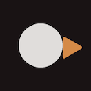
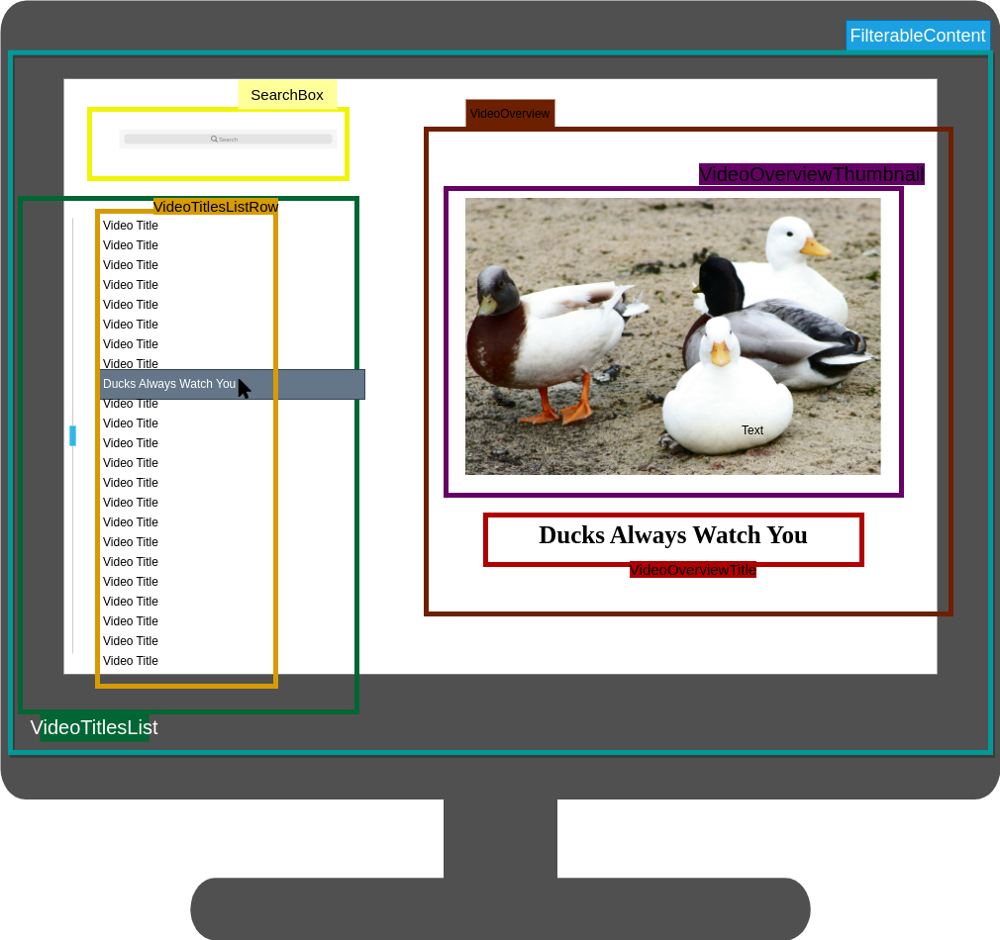
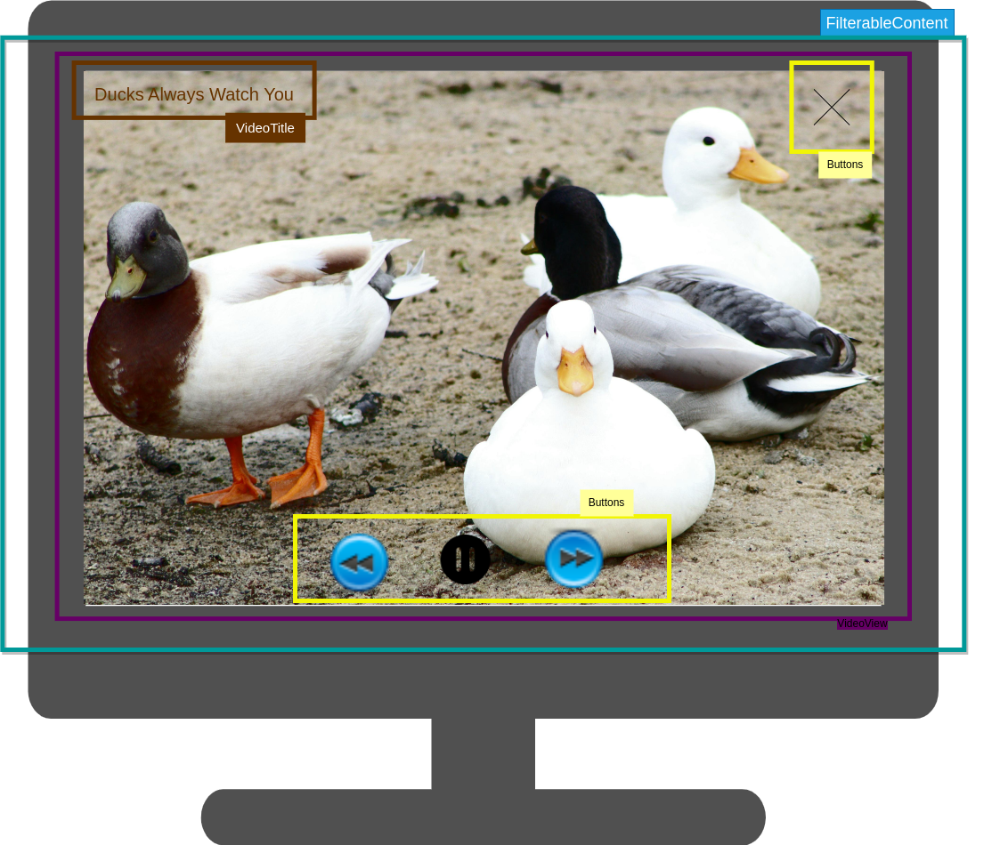

# DuckStream
A video streamer application that keep call duck alive <3

## Initial Idea
A hands-on PoC of [NetFlix TV App in React](https://netflixtechblog.com/crafting-a-high-performance-tv-user-interface-using-react-3350e5a6ad3b) .

## Logo & Color Theme

Logo symbolizes both call duck and multimedia symbol:
- Left circle which is the symbol of record button, and
- Right triangle which is the symbol of play button

## User Interface
Both arranged as such and combined create the silhouette of call duck.
Color scheme for logo based on call duck color in real life, generated by the power of canva.com:
- Swiss Coffee (Broken White) #E0DDDB
- Raw Sienna (Orange) #D58A47
- Cocoa Brown (Black-ish) #191314
- Tuscany (Orange-Maroon) #B65B2A

### Menu Overview
#### Components
Below is the rough representation how the menu UI looks like:
 

- `FilterableContent` (blue) the basic layout that containerize every other components which are:
    - `SearchBox` (yellow) receives user input which is a text to match desired video title
    - `VideoTitlesList` (green) displays all the titles if not filtered from `SearchBox` and let user hover or select one of the titles which contains:
        - `VideoTitlesListRow` (orange) displays a row of each video titles and can be dynamically scrolled
    - `VideoOverview` (brown) display the detail of each video title focused from `VideoTitleList`, which includes:
        - `VideoOverviewThumbnail` (purple) display the thumbnail of video corresponds to the title hover
        - `VideoOverviewTitle` (red) display hovered video title

#### States
That being said, components that require states are:
0. Highlight surroundings when click these components:
    - `VideoTitlesListRow`
    - `SearchBox`
1. `SearchBox` that will receive input characters and pass them as prop of substring to match with video title lists, and
2. `VideoTitlesList` that will display video titles that matches with input string on `SearchBox` if there is any. If it is empty, will display the whole list.
3. `VideoOverviewTitle` will display video title selected from `VideoTitlesListRow`
4. `VideoOverviewThumbnail` have several actions:
    - Display thumbnail of each video title
    - When the cursor hover over it, it will give instruction to user to press the thumbnail if they want to open video interactive player that deal with the video

As you can see, all of the components share same parent component - `FilterableContent` , thus this content will be the place where the state handling will be added.

### Video Player Overview
The video player view pop up after user click one of the title:

 
 
- `ReactTV` (blue) the basic layout that containerize every other components:
    - `VideoView` (purple) displays video alongside with:
        - `VideoTitle` (brown) displays video title
        - `Buttons` (yellow) displays buttons that trigger different states each

#### States
Here are components that requires state:
0. View `VideoView` component when clicking `VideoTitlesListRow`
1. Show the *close* button when hover over top right of `VideoView`
2. Return to `FilterableContent` when clicking *close* button on `VideoView`